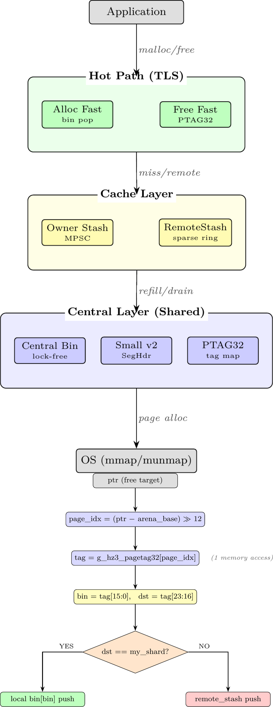

# hakozuna (hz3)

[](https://doi.org/10.5281/zenodo.18305953)

**A high-performance memory allocator competitive with mimalloc and tcmalloc**

Part of the [hakorune](https://github.com/hakorune) project.

---

## Highlights

- **Performance**: Matches or exceeds mimalloc/tcmalloc in multi-threaded workloads
- **Remote-free optimization**: +28% over mimalloc at 50%+ remote-free ratio
- **Box Theory design**: Boundary-focused architecture with reversible optimizations
- **Two lanes**: `fast` (low latency) and `scale` (high parallelism)

## Architecture



## Paper

- [ACE-Alloc Paper (English)](docs/paper/main_en.pdf)
- [ACE-Alloc Paper (日本語)](docs/paper/main_ja.pdf)

## Quick Start

```bash
# Build (scale lane, default)
make clean all_ldpreload_scale

# Smoke test
LD_PRELOAD=./libhakozuna_hz3_scale.so /bin/true

# Run with your application
LD_PRELOAD=./libhakozuna_hz3_scale.so ./your_app
```

## Build Options

| Target | Output | Use case |
|--------|--------|----------|
| `all_ldpreload_scale` | `libhakozuna_hz3_scale.so` | Default, 32 shards, high parallelism |
| `all_ldpreload_fast` | `libhakozuna_hz3_fast.so` | 8 shards, low latency |
| `all_ldpreload_scale_tolerant` | - | Collision-tolerant for very high thread counts |

### Preset Variants

```bash
# Remote-heavy optimized (r50 = 50% remote ratio target)
make all_ldpreload_scale_r50
make all_ldpreload_scale_r50_s97_1   # S97-1 remote bucketize
make all_ldpreload_scale_r50_s97_8   # S97-8 sort+group (stack-only)

# High remote ratio (r90 = 90% remote ratio target)
make all_ldpreload_scale_r90
make all_ldpreload_scale_r90_pf2
make all_ldpreload_scale_r90_pf2_s97_2   # Direct-map (best at T>=16)
make all_ldpreload_scale_r90_pf2_s97_8_t8 # Sort+group (best at T=8)
```

## Benchmarks

Run the SSOT benchmark suite:

```bash
RUNS=10 ITERS=20000000 WS=400 ./scripts/run_bench_hz3_ssot.sh
```

### Larson (ops/sec, higher is better)

| Threads | hakozuna | mimalloc | tcmalloc | system |
|---------|-----|----------|----------|--------|
| T=1 | 31.74M | 27.00M | 31.19M | 22.40M |
| T=4 | 109.04M | 95.17M | 104.29M | 80.56M |
| T=8 | **196.16M** | 169.83M | 170.35M | 137.81M |
| T=16 | **296.51M** | 257.57M | 246.06M | 204.25M |

### memcached (ops/sec, higher is better)

| Threads | hakozuna | mimalloc | tcmalloc |
|---------|-----|----------|----------|
| T=1 | 278,109 | 283,697 | 280,453 |
| T=4 | **816,008** | 741,478 | 809,366 |
| T=8 | 1,298,515 | 1,301,294 | 1,304,450 |
| T=16 | **1,487,819** | 1,471,710 | 1,374,252 |

### MT Remote-Free (ops/sec, higher is better)

| Condition | hakozuna | mimalloc | tcmalloc |
|-----------|-----|----------|----------|
| T=8 R=90% | **172.5M** | 134.6M | 140.9M |
| T=16 R=50% | **240.7M** | 188.8M | 196.2M |
| T=32 R=90% | 144.7M | **181.1M** | 106.1M |

### random_mixed (ops/sec, higher is better)

| Allocator | Throughput |
|-----------|------------|
| tcmalloc | 134.6M |
| hakozuna | 132.6M |
| mimalloc | 130.2M |
| system | 108.5M |

**Summary**: hakozuna wins in most multi-threaded workloads, especially remote-free heavy scenarios (+28%). At extreme thread counts (T=32 R=90%), mimalloc currently leads.

## Documentation

- [Build Flags Index](docs/BUILD_FLAGS_INDEX.md)
- [Paper Notes](docs/HAKMEM_HZ3_PAPER_NOTES.md)

## Design Principles (Box Theory)

1. **Boundary concentration**: Minimize hot path / control layer crossings
2. **Reversibility**: All optimizations toggleable via compile-time flags
3. **Observability**: SSOT (atexit one-shot stats) for reproducible profiling
4. **Fail-fast**: Detect invalid states at boundaries, abort early

## Safety Notes

Some performance flags disable debug invariants:
- `HZ3_S97_REMOTE_STASH_SKIP_TAIL_NULL=1` is incompatible with `HZ3_LIST_FAILFAST`, `HZ3_CENTRAL_DEBUG`, `HZ3_XFER_DEBUG`

## License

Apache License 2.0

---

Version: 2026.01.18
